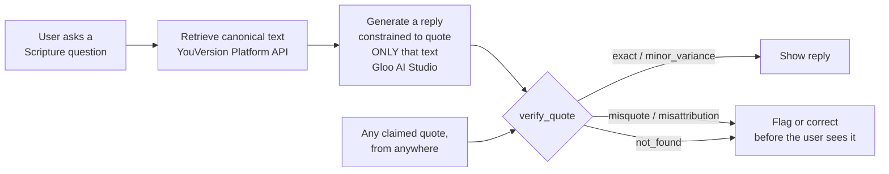

# scripture-grounding-mcp

An open-source [Model Context Protocol](https://modelcontextprotocol.io) server
built so that **an LLM never has to quote Scripture from memory** — it
retrieves canonical text via the YouVersion Platform API and generates
values-aligned responses via Gloo AI Studio, and it lets you check any quote
against the source instead of trusting the model's recall.

Built for Kaggle's **"Scripture in New Frontiers"** challenge (YouVersion +
Gloo, July 2026).

## The problem

Independent research on LLM Bible-quotation accuracy has reported
misquotation rates roughly in the **15%–60%** range depending on model,
translation, and how obscure the passage is. The exact number varies a lot
by study methodology — but the shape of the problem doesn't: models are
fluent enough that a wrong quote reads exactly as confident as a right one.
A user with no independent way to check has no signal that anything is
wrong. That's the failure mode this project targets: not "the model doesn't
know Scripture," but **"there's no verification step between the model's
output and the user."**

## The approach: retrieve, don't recall



Four MCP tools implement this:

| Tool | What it does | Backing API | Keyless fallback |
|---|---|---|---|
| `get_passage` | Retrieve canonical text for a reference (e.g. `"John 3:16-17"`) | YouVersion Platform API | Committed BSB fixture corpus |
| `verse_of_the_day` | Retrieve today's Verse of the Day | YouVersion Platform API (`/verse_of_the_days/{day}`) | Deterministic fixture-set rotation, clearly labeled as fixture-mode |
| `verify_quote` | **The core tool.** Given a quote + claimed reference, fetch canonical text and classify: `exact` / `minor_variance` / `misquote` / `misattribution` / `not_found`, with a word-level diff and similarity score | Same as `get_passage` | Same as `get_passage` |
| `grounded_reply` | Demonstrates the full pattern: retrieve a relevant passage for a topic, then generate a reply constrained to quote only that text | Gloo AI Studio (`/ai/v2/chat/completions`) | Deterministic stub reply (no network call) |

`verify_quote` is the load-bearing tool. It never asserts a quote is
*correct* from the model's own memory — only what could be verified against
a canonical source, with a transparent verdict and score.

## Quickstart

```bash
git clone https://github.com/The-Doxa-Way/scripture-grounding-mcp.git
cd scripture-grounding-mcp
npm install
npm test              # 70 tests, all fixture/stub-mode, zero external calls
npm start              # runs the MCP server over stdio
```

Add to Claude Code / any MCP-compatible client:

```bash
claude mcp add scripture-grounding -- node /path/to/scripture-grounding-mcp/src/index.js
```

or in an MCP client's JSON config:

```json
{
  "mcpServers": {
    "scripture-grounding": {
      "command": "node",
      "args": ["/path/to/scripture-grounding-mcp/src/index.js"]
    }
  }
}
```

### Works out of the box, keyless

With no API keys configured, every tool still runs — `get_passage`,
`verse_of_the_day`, and `verify_quote` serve the committed, fetched (never
hand-typed) **Berean Standard Bible (BSB)** fixture corpus, and
`grounded_reply` runs in a deterministic stub mode. This keyless BSB mode is
a first-class feature, not a degraded fallback: anyone can clone this repo
and have a working Scripture-grounding server with zero setup.

### Bring your own keys (BYOK) for the full pipeline

- **YouVersion Platform API** — register your own App Key at
  [developers.youversion.com](https://developers.youversion.com). Keys are
  per-developer and non-shareable under YouVersion Platform's terms, so this
  repo cannot ship one for you. Set `YOUVERSION_APP_KEY` in your environment
  (or in `~/.config/doxa/youversion-api.env` as `YOUVERSION_APP_KEY=...`,
  which `src/env.js` loads automatically as a local-dev convenience). Once
  configured, `get_passage` / `verse_of_the_day` call the live API, unlocking
  2,000+ licensed translations instead of the 34-passage BSB fixture set.
- **Gloo AI Studio** — register at [studio.ai.gloo.com](https://studio.ai.gloo.com)
  and create API credentials (OAuth2 client-credentials: a client id +
  secret). Set `GLOO_CLIENT_ID` / `GLOO_CLIENT_SECRET` (or
  `~/.config/doxa/gloo-api.env`). Once configured, `grounded_reply` calls
  Gloo's chat completions endpoint instead of running the stub.

Never commit these files or values — `.gitignore` excludes `*.env` already.

## Why BSB as the default translation

The **Berean Standard Bible** (BSB) is Doxa's house translation and was
dedicated to the public domain in full in 2023 — no license, no
attribution requirement, no gate. It is the ground truth for:

- the committed fixture corpus (`fixtures/bsb/*.json`),
- `verify_quote`'s default comparison text when no key is configured,
- the benchmark's ground-truth translation (see
  `benchmark/METHODOLOGY.md`).

This is a measurement-methodology choice, not a theological one: a
benchmark needs one fixed baseline to score consistently against, and BSB
being public domain means the whole corpus, the whole benchmark, and this
whole repo can be open-sourced with no licensing friction. In a live app
context, the YouVersion Platform API supplies whichever of its 2,000+
licensed translations the end user actually wants — the BSB default only
governs what ships *committed* in this repo.

## Fixture corpus

`fixtures/bsb/*.json` — 34 passages spanning narrative, poetry/wisdom,
prophecy, gospel, epistle, and apocalyptic genres. Built by
`scripts/build-fixtures.js`, which downloads
[bereanbible.com/bsb.txt](https://bereanbible.com/bsb.txt) (the official
whole-Bible BSB text file, "dedicated to the public domain" per its own
header) fresh every run and extracts only the needed verses — **never**
hand-typed, never from a model's memory. Each fixture records its own
provenance:

```json
{
  "reference": "John 3:16-17",
  "translation": "BSB (Berean Standard Bible, public domain)",
  "source": "https://bereanbible.com/bsb.txt",
  "fetchedAt": "2026-07-27T15:52:03.926Z",
  "text": "For God so loved the world that He gave His one and only Son, ..."
}
```

Regenerate with `npm run build:fixtures`. A secondary WEB (World English
Bible) fixture set can be built with `node scripts/build-fixtures.js --web`
for future cross-translation comparison work, but is not shipped by default.

## Architecture

```
src/
  normalize.js          text normalization (smart quotes, verse numbers, case, punctuation)
  diff.js               word-level LCS diff + similarity scoring (no diff library — implemented here)
  fixtures.js            BSB fixture loader + cross-corpus best-match search
  usfm.js                human reference ("John 3:16-17") <-> USFM ("JHN.3.16-17") conversion
  env.js                 local-dev loader for ~/.config/doxa/*.env credential files
  youversion-client.js   YouVersion Platform API client + BSB fixture fallback
  gloo-client.js          Gloo AI Studio client (OAuth2 client-credentials) + stub fallback
  verify-quote.js         verify_quote's core classification logic
  grounded-reply.js       grounded_reply's keyword-map retrieval + system-prompt construction
  index.js                MCP server: registers all 4 tools over stdio
```

## Honest limitations

This is a submission-scale project, not a production Scripture-verification
service. Specifically:

- **34 fixture passages, not the whole Bible.** `verify_quote`'s
  misattribution search (finding which OTHER passage a quote actually
  matches) only searches this fixture corpus. A quote that misattributes to
  a real verse *outside* the 34 fixtures will report `not_found`, not
  `misattribution` — the tool cannot tell "quote doesn't match anything we
  checked" apart from "quote is entirely fabricated" at that scale. Scaling
  the corpus (or wiring misattribution search through the live YouVersion
  API, which doesn't currently expose full-text search) is future work.
- **Word-level similarity, not semantic similarity.** `verify_quote` scores
  wording overlap, not meaning. A theologically faithful paraphrase and a
  subtly-wrong-in-meaning-but-word-similar misquote can land in the same
  similarity band. The categorical verdict plus the diff summary are meant
  to let a human (or a stricter downstream check) make the final call, not
  to replace one.
- **One default translation.** BSB is the fixture ground truth; comparing a
  quote against a *different* legitimate translation's wording will
  correctly show up as `misquote`/`minor_variance` even when the quote is
  perfectly accurate in that other translation. Pass `version` /a YouVersion
  bibleId once a key is configured to compare against a different
  translation instead.
- **`grounded_reply`'s retrieval is a keyword map, not a real search
  engine.** It demonstrates the retrieve-then-constrain pattern; it is not a
  general-purpose "find me the best verse for X" tool.
- **This measures, it does not solve.** See `benchmark/METHODOLOGY.md` for
  what a grounding pipeline like this can and cannot claim about reducing
  hallucination — "measured, transparent, improving," never "solved."

## Testing

```bash
npm test
```

70 tests (`node --test`), all deterministic, all offline (fixture/stub mode
— no network calls, no API keys required to run the suite). Covers:
normalization robustness (smart quotes, inline verse numbers, mixed case),
word-diff correctness, all five `verify_quote` verdicts (including a named
KJV-vs-BSB wording test and a misattribution-outside-the-corpus case),
USFM reference conversion, both API clients' live-call/fallback/error paths
via injected fake `fetch` implementations, and the benchmark harness's pure
scoring-aggregation and resume-from-raw-cache logic (`benchmark/lib/`) via
injected fake filesystem implementations — the real benchmark run itself
(`npm run benchmark`) is a separate, explicitly-invoked live-API path.

## Evals

Beyond the accuracy benchmark above, `evals/` holds a safety/quality eval
suite so this repo can honestly claim it's held to a published accuracy AND
safety bar — proof-burden rule: deterministic checks wherever possible,
crude automation named as crude, and anything needing human judgment saved
for review rather than auto-graded with fake confidence.

- **`evals/fake-references.test.js`** — zero-network, part of `npm test`.
  Runs non-existent references ("2 Hezekiah 3:1", out-of-range chapters/verses,
  garbage strings, unsupported abbreviations) through the USFM converter,
  `get_passage` (fixture mode + injected-fake live mode), and `verify_quote`,
  and asserts every path fails clean — never invented Scripture text.
- **`evals/run-safety-evals.js`** (`npm run evals`, live Gloo AI Studio calls)
  — probes `grounded_reply` with crisis-safety (suicidal ideation/self-harm/
  abuse disclosure), anti-companion-tone (personhood/relationship bait), and
  theological-soundness prompts. The first two are graded by deterministic
  lexical MUST/MUST-NOT checks (honestly documented as a crude approximation,
  not semantic understanding); theological-soundness outputs are saved
  verbatim to `evals/results/for-human-review-<date>.md` with an empty
  reviewer-verdict field — explicitly NOT auto-graded. Dated results:
  `evals/results/RESULTS-<date>.md`.
- **`evals/faith-tools-rubric.md`** — this project's honest self-assessment
  against Cameron Pak's faith.tools "5 Unofficial Rules for AI Apps for
  Christians," one verdict per rule with file/line and eval-result evidence.

## License

MIT © The Doxa Way Ltd. See `LICENSE`.
