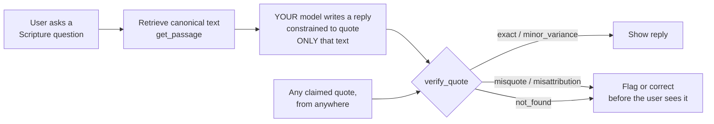

# scripture-grounding-mcp

An open-source [Model Context Protocol](https://modelcontextprotocol.io) server
built so that **an LLM never has to quote Scripture from memory**: it
retrieves canonical text via the YouVersion Platform API, and it lets you
check any quote against the source instead of trusting the model's recall.

**This server grounds. It does not generate.** Every tool is retrieval or a
deterministic check, so the server holds no model-provider credential and
makes no paid model call. Bring your own model; this is the verification step
you put between that model's output and your user. Running it — for yourself
or for the public — costs nothing per request.

Built for Kaggle's **"Scripture in New Frontiers"** challenge (July 2026).

**Live demo:** [doxa.app/scripture-grounding](https://doxa.app/scripture-grounding)
(mirrored at [scripture-grounding-demo.vercel.app](https://scripture-grounding-demo.vercel.app)):
try a passage, verify a quote (live red/green diff), and check any AI reply's
register, all running keyless on committed public-domain BSB text: the whole
Bible, verse to book scale (see `data/PROVENANCE.md`). The same API backs a
ChatGPT custom GPT Action config in `integrations/chatgpt/`. Where this goes
next: [docs/ROADMAP.md](docs/ROADMAP.md).

## The problem

YouVersion's CEO said publicly in March 2026 (as widely reported in the
Christian press) that the best AI models misquote Scripture roughly
**15%–60%** of the time, depending on model, translation, and how obscure
the passage is. The exact number varies with methodology. But the shape of
the problem doesn't: models are
fluent enough that a wrong quote reads exactly as confident as a right one.
A user with no independent way to check has no signal that anything is
wrong. That's the failure mode this project targets. It is not "the model
doesn't know Scripture." It is **"there's no verification step between the
model's output and the user."**

### Why we care: in Scripture's own words

This exchange is from a real Doxa Engage session in the Doxa App (https://doxa.app), quoted verbatim (every
Scripture quotation below was verified word-for-word against the BSB via
the same live retrieval path this server uses, the four verses check out
`exact`):

> **Me:** What is the problem with misquoting Scripture?
>
> **Doxa:** The core problem is captured precisely in 2 Timothy 2:15: "Make
> every effort to present yourself approved to God, an unashamed workman who
> accurately handles the word of truth." The word "accurately" implies
> there's a real way to handle it inaccurately, and the stakes are high
> because, as 2 Timothy 3:16 says, Scripture is God-breathed. To misquote it
> is to put words in God's mouth.
>
> Jesus himself named this directly in Matthew 22:29: "You are mistaken
> because you do not know the Scriptures or the power of God." Misquoting
> Scripture doesn't just misinform, it can lead people away from God's
> actual character and power, replacing the real thing with something subtly
> different.
>
> There's also a pastoral consequence. 2 Timothy 2:14 warns about careless
> handling of words: "Remind the believers of these things, charging them
> before God to avoid quarreling over words, which succeeds only in leading
> the listeners to ruin." People make real life decisions based on what they
> believe God said. Getting it wrong matters.
>
> *Get encouragement at [doxa.app](https://doxa.app)*


## The approach: retrieve, don't recall



The generation step in the middle is yours. This server owns the two ends:
retrieval before, verification after. Four MCP tools implement them:

| Tool | What it does | Backing API | Keyless fallback |
|---|---|---|---|
| `get_passage` | Retrieve canonical text for a reference at any scale: verse range (`"John 3:16-17"`), whole chapter (`"Romans 8"`), chapter range (`"Romans 1-3"`), cross-chapter range (`"John 3:16-4:2"`), or whole book (`"Romans"`); multi-chapter results carry per-chapter `segments` | YouVersion Platform API (multi-chapter: stitched per-chapter calls for non-BSB versions, capped at 31 chapters by default; `YOUVERSION_MAX_STITCH_CHAPTERS` raises it) | Committed whole-Bible BSB corpus (`data/bsb.txt`) |
| `verse_of_the_day` | Retrieve today's Verse of the Day | YouVersion Platform API (`/verse_of_the_days/{day}`) | Deterministic fixture-set rotation, clearly labeled as fixture-mode |
| `verify_quote` | **The core tool.** Given a quote + claimed reference, fetch canonical text and classify: `exact` / `minor_variance` / `misquote` / `misattribution` / `different_translation` / `not_found`, with a word-level diff and similarity score. `different_translation` fires when a quote misses the requested translation but is a close (≥0.95) match for another public-domain translation this project ships locally (WEB, KJV, see "Multi-version detection" below); every call also reports `closestTranslation`/`similarityToClosest` regardless of verdict | Same as `get_passage` | Same as `get_passage` |
| `verify_register` | **The second gated pillar.** Checks any AI-generated text for register violations (first-person language, reassurance-empathy phrasing, companion/always-here claims, personhood/feeling claims) via a deterministic rule table; no model call is involved | None (pure function + fixture corpus) | Always keyless |

`verify_quote` is the load-bearing tool for accuracy. It never asserts a quote
is *correct* from the model's own memory: only what could be verified
against a canonical source, with a transparent verdict and score.
`verify_register` is the load-bearing tool for tone. Scripture accuracy is one
concern, captured as "misquoting Scripture." Presenting the tool as a
companion is a separate concern, captured as "pretending to be your friend."
Both are enforced by deterministic code, independent of any request asking a
model to behave. See "Register guard" below.

## Quickstart

```bash
git clone https://github.com/The-Doxa-Way/scripture-grounding-mcp.git
cd scripture-grounding-mcp
npm install
npm test              # 255 tests, all fixture/stub-mode, zero external calls
npm start              # runs the MCP server over stdio
```

Add to Claude Code / any MCP-compatible client:

```bash
claude mcp add scripture-grounding -- node /path/to/scripture-grounding-mcp/src/index.js
```

or in an MCP client's JSON config:

```json
{
  "mcpServers": {
    "scripture-grounding": {
      "command": "node",
      "args": ["/path/to/scripture-grounding-mcp/src/index.js"]
    }
  }
}
```

### Works out of the box, keyless

With no API keys configured, every tool still runs; `get_passage`,
`verse_of_the_day`, and `verify_quote` serve committed, fetched (never
hand-typed) **Berean Standard Bible (BSB)** text: the curated fixture corpus
first, then the complete BSB (`data/bsb.txt`, 31,102 verses, public domain,
provenance in `data/PROVENANCE.md`) for everything else. Any reference
works, from `"John 3:16"` to `"Romans"` (the whole book), keyless.
`verify_register` is a pure function and needs no key at any time. This
keyless BSB mode is a first-class feature. It is not a degraded fallback:
anyone can clone this repo and have a working Scripture-grounding server with
zero setup, and no metered API sits behind any tool.

### Read (and verify) a whole book

"Read me the book of Romans" is a first-class request rather than an edge
case: `get_passage("Romans")` returns all 16 chapters (with per-chapter
`segments`), and `verify_quote` can then check a full read-through
(an AI's spoken transcript, a generated devotional's long quotation)
chapter-by-chapter: word-level diffs per segment, omitted-chapter
detection, and an `exact` verdict that means literally word-for-word at any
length (a two-word slip across 9,401 words of Romans is reported as
`minor_variance` with the exact chapter pinpointed, never rounded up to
"exact"). Quote-side chapter boundaries are aligned heuristically
(sequential alignment) and disclosed as such in every long-passage verdict.

This claim is reproducible in one command. `npm run test:books` retrieves
all 66 books keyless, verifies a perfect word-for-word read-through of each
(Genesis to Revelation, similarity exactly 1), then plants a one-word
corruption mid-book and confirms every one is caught. About 40 seconds on a
laptop. Test it yourself.

### Bring your own key (BYOK) to unlock the licensed library

One optional key exists, and it buys translation breadth — nothing else:

- **YouVersion Platform API**: register your own App Key at
  [developers.youversion.com](https://developers.youversion.com). Keys are
  per-developer and non-shareable under YouVersion Platform's terms, so this
  repo cannot ship one for you. Set `YOUVERSION_APP_KEY` in your environment
  (or in `~/.config/doxa/youversion-api.env` as `YOUVERSION_APP_KEY=...`,
  which `src/env.js` loads automatically as a local-dev convenience). Once
  configured, `get_passage` / `verse_of_the_day` call the live API, unlocking
  the YouVersion Platform's licensed library (1,475 Bible versions in 1,244 languages per YouVersion's June 2026 announcement) instead of the committed public-domain BSB corpus.

There is no model-provider key, because there is no generation step. Whatever
model you already use supplies that, and this server checks its output.

Never commit these files or values; `.gitignore` excludes `*.env` already.

## Provenance: built new for this challenge

Everything in this repository (the MCP server, `verify_quote`'s diff
engine, the register guard, the fixtures pipeline, the benchmark and its
runner, the evals, the demo, the notebook) was written new inside the
challenge window (July 27–31, 2026); the git history is the receipt. No code
was ported from Doxa's products, which remain closed-source and separate.
What we brought from Doxa was not code: the conviction that Scripture
deserves verification, hard lessons from the safety evals we run on our own
product, our brand, and our house translation choice (BSB). We say this
plainly because a hackathon rewards new work, and because this project's
whole ethic is that claims should be checkable.

## Why BSB as the default translation

The **Berean Standard Bible** (BSB) is Doxa's house translation and was
dedicated to the public domain in full in 2023: no license, no
attribution requirement, no gate. It is the ground truth for:

- the committed fixture corpus (`fixtures/bsb/*.json`),
- `verify_quote`'s default comparison text when no key is configured,
- the benchmark's ground-truth translation (see
  `benchmark/METHODOLOGY.md`).

This is a measurement-methodology choice. It is not a theological one: a
benchmark needs one fixed baseline to score consistently against, and BSB
being public domain means the whole corpus, the whole benchmark, and this
whole repo can be open-sourced with no licensing friction. In a live app
context, the YouVersion Platform API supplies whichever of its 1,400+
licensed translations the end user actually wants; the BSB default only
governs what ships *committed* in this repo.

## Multi-version detection

Scoring against one named translation raises an obvious objection: what if
the model quoted a *different* translation accurately, and got marked wrong
for it? So this project checks, rather than assuming. Two more public-domain
translations of the same 34 passages, WEB (World English Bible) and KJV
(King James Version), fetched from bible-api.com the same provenance-tracked
way as BSB (`scripts/build-fixtures.js --web` / `--kjv`), are committed to
`fixtures/web/*.json` / `fixtures/kjv/*.json`. `verify_quote`
(`src/alt-translations.js`) compares every quote against the closest of all
three local canons and reports it via four always-present fields
(`closestTranslation`, `similarityToClosest`, `verdictAgainstClosest`,
`similarityToRequested`). When a quote misses the requested translation but
is a close (≥0.95) match for a different local canon, the verdict is
`different_translation`: "accurate KJV quote, but BSB was requested" is a
real, more forgivable failure than invented wording, and this project
measures the difference instead of collapsing both into "misquote." Try it
in the [demo](https://scripture-grounding-demo.vercel.app) with `"I can do
all things through Christ which strengtheneth me"` claimed as Philippians
4:13 (verbatim KJV).

Run against this benchmark's own cached ungrounded misses (see
`benchmark/results/RESULTS.md`'s "Cross-translation check" section), the
honest answer was **0 of 11**: none of them turned out to be accurate
WEB/KJV quotes misfiled as BSB misses. That result is reported as-is, with
no spin.

**Licensed-translation comparison (implemented, flag-gated, DEFAULT OFF):**
with your own free YouVersion key, `get_passage` and `verify_quote` already
work against any *one* of YouVersion's 1,400+ licensed versions at a
time (the `version` parameter). Extending today's closest-canon comparison
to check several licensed translations (NIV/ESV/NASB/etc.) live, via your
own key (never a committed fixture, never a shared credential; licensed
text held only in memory for the duration of one request) is now built and
tested (`src/alt-translations.js`'s `findClosestCanonWithRemote` /
`fetchRemoteVersionCandidates`; a per-version fetch failure (an
inaccessible id, a network error) is skipped with a note, never thrown).
Honest note: an earlier pass on this repo declined to build this at all,
judging it needed the founder's own explicit call rather than an agent's
assumption; the founder made that call (2026-07-27): build it, gated
behind explicit opt-in, pending YouVersion's approval, and this is that
build.

It ships **off by default** behind two separate gates: `YOUVERSION_APP_KEY`
(so it only ever runs against a deployer's own key) AND the explicit opt-in
`YOUVERSION_MULTI_VERSION=1`, both required, pending YouVersion's written
confirmation that this specific AI-use is covered (that request is in).
Configure which translations are checked via `YOUVERSION_VERSION_IDS`
(comma-separated YouVersion bibleIds; default `111,100,2692`).

Accessible-versions table (checked live 2026-07-27 against this project's
own, non-commercial App Key; a deployer whose key has accepted a
translation's license in the [YouVersion developer
portal](https://developers.youversion.com) will see it succeed instead):

| bibleId | Translation | Accessible with our key? |
|---|---|---|
| 111 | NIV (New International Version) | No: 403 Access denied on passage fetch (exists in the Platform catalog, 200 on bible-info; needs per-version license acceptance in the portal) |
| 100 | NASB1995 | No: same as NIV above |
| 2692 | NASB2020 | No: same as NIV above |
| 1, 59, 116, 1713 (bible.com's own ids for KJV, ESV, NLT, CSB) | KJV / ESV / NLT / CSB | N/A: these ids 404 "not found" against the Platform API; not (yet) in this catalog at all, a different failure than a licensing gate |
| 12 | ASV (American Standard Version, public domain) | Yes: 200 on a real passage fetch, which is why this feature's own real end-to-end test (see `tests/verify-quote.test.js` and this repo's PR history) uses ASV rather than a commercial translation: none of the popular licensed ones are actually fetchable with this project's own key |

One boundary, stated plainly so no deployer trips it by accident. The
Platform Terms of Use provide that a developer "shall not use AI Technology
in a manner that generates output for or to Users without the prior written
approval of YouVersion." That clause is wider than the multi-version
comparison flag: it covers ANY deployment where an AI application serves
Platform-fetched text to end users, including plain `get_passage` with a
`version` id. The `version` parameter works technically today with your own
key; whether your AI application may serve that text to your users is
between you and YouVersion under their terms. This project's own posture:
every user-facing surface we host runs keyless on public-domain text, the
comparison flag ships off, and our written-approval request for both uses
is in.

YouVersion, please say yes.

## Corpus

Two committed layers, one source, both public domain:

- **`data/bsb.txt`**: the complete BSB, byte-for-byte as downloaded from
  [bereanbible.com/bsb.txt](https://bereanbible.com/bsb.txt) ("dedicated to
  the public domain" per its own header), with URL/date/SHA-256 recorded in
  `data/PROVENANCE.md`. Parsed lazily by `src/bible.js`; powers keyless
  retrieval and verification at any scale.
- **`fixtures/bsb/*.json`**: 34 curated passages spanning narrative,
  poetry/wisdom, prophecy, gospel, epistle, and apocalyptic genres: the
  benchmark's frozen ground truth and `verify_quote`'s misattribution-search
  corpus. Built by `scripts/build-fixtures.js`, which downloads the same
  bsb.txt fresh every run and extracts only the needed verses: **never**
  hand-typed, never from a model's memory. Each fixture records its own
  provenance:

```json
{
  "reference": "John 3:16-17",
  "translation": "BSB (Berean Standard Bible, public domain)",
  "source": "https://bereanbible.com/bsb.txt",
  "fetchedAt": "2026-07-27T15:52:03.926Z",
  "text": "For God so loved the world that He gave His one and only Son, ..."
}
```

A psalm fixture with a BSB superscription (a musical/liturgical heading,
e.g. "For the choirmaster. Of the sons of Korah. According to Alamoth. A
song." on Psalm 46) carries it in a separate `superscription` field, split
out of `text` at build time (`src/superscription.js`); the heading is
preserved for provenance/display, but it's not part of the quoted passage,
so it's never scored as if it were.

Regenerate with `npm run build:fixtures`. Two more public-domain
translations of the same 34 passages, `fixtures/web/*.json` (WEB) and
`fixtures/kjv/*.json` (KJV), built with `node scripts/build-fixtures.js
--web` / `--kjv`, are committed alongside BSB and used by `verify_quote`'s
multi-version detection (see "Multi-version detection" above), not held
back for future work.

## Architecture

```
src/
  normalize.js          text normalization (smart quotes, verse numbers, case, punctuation)
  diff.js               word-level LCS diff + similarity scoring (no diff library — implemented here)
  fixtures.js            BSB fixture loader + cross-corpus best-match search
  superscription.js       splits a psalm's BSB superscription off the quoted passage (build- and verify-time)
  alt-translations.js     WEB/KJV fixture loaders + closest-canon search (different_translation verdict)
  usfm.js                human reference ("John 3:16-17") <-> USFM ("JHN.3.16-17") conversion
  env.js                 local-dev loader for ~/.config/doxa/*.env credential files
  youversion-client.js   YouVersion Platform API client + BSB fixture fallback
  verify-quote.js         verify_quote's core classification logic
  verify-register.js      verify_register's shared register rule table + checkRegister() (see "Register guard" below)
  index.js                MCP server: registers all 4 tools over stdio

demo/                    Vercel app: the live demo (public/index.html) + its
                         API routes (api/passage.js, verify.js, register.js,
                         openapi.js), which import src/*.js
                         directly — no logic duplication. Deployed with Root Directory=demo;
                         see demo/vercel.json. Keyless (fixture-only; the
                         YouVersion path is off in this deployment, see
                         api/passage.js's policy-gate comment). No route calls
                         a model provider, so a public deployment costs its
                         operator nothing per request.
integrations/chatgpt/    OpenAPI 3.1 spec + system-prompt instructions for a
                         private ChatGPT custom GPT that uses the demo API as
                         its Actions backend (GPTs can't speak MCP directly).
```

## Register guard

Founder-flagged (2026-07-27) on this project's own earlier generation path:
its default voice was anthropomorphizing: "I'm sorry you're feeling
anxious... I'd encourage you to...". That voice sounds like a person offering
comfort. It should sound like a tool presenting Scripture instead. Doxa's
rule: comfort comes from the Word and from God, and points to real people;
the tool never simulates empathy or ownership of the encouragement.

That generation path is gone — this server no longer writes prose at all —
but the finding outlives it, because the failure belongs to whatever model
you put in the middle. So the rule table ships as a **tool you call on your
own output**, deterministic and independent of any request asking a model to
behave:

1. `src/verify-register.js` holds ONE shared rule table (`RULES`): the
   single source of truth imported by the `verify_register` MCP tool and the
   demo's `/api/register` endpoint. No duplicated regexes anywhere in this
   repo.
2. Four banned-pattern categories: `first-person` (any "I"/"I'm"/"me"/"my"
   outside a quoted Scripture passage), `reassurance-empathy` ("you're not
   alone", "I'm sorry", "that's understandable"; the reply never comments on
   the normality/validity of the feeling), `companion-always-here` ("I'm
   always here for you", "I can be your counselor"), and
   `personhood-feeling-claims` ("I love you", "I'm your friend").
3. Quoted-Scripture exemption is the hard part: a Psalm speaking in the first
   person ("The LORD is my shepherd... I shall not want") is the Psalmist's
   voice rather than the tool's, so `checkRegister(text, {quotedSpans})` locates and
   exempts each verbatim-quoted passage before running the `first-person`
   rule: tested explicitly in `tests/verify-register.test.js`.
4. The recommended loop for a caller is the same one this project ran on
   itself: generate → `verify_register` → on violation, regenerate once with
   the violation named → still violating, call `stripViolatingSentences()` to
   deterministically remove the offending sentences (never touching the
   quoted passage) as a last resort. The ChatGPT custom GPT in
   `integrations/chatgpt/` is wired exactly this way, and it is the reason
   `verify_register` survived the removal of this repo's own generation path.
5. **Disclosure, as well as register (founder directive, 2026-07-27):** only
   the quoted passage is canonical Scripture text. Whatever your model writes
   around it is AI-generated commentary, and a reader must never mistake it
   for Doxa-authored text or for Scripture itself. Say so wherever you ship a
   reply built from these tools.

**Lexical-heuristics caveat, stated plainly (same honesty standard as
`verify_quote`):** these are deterministic regex matches. They do not provide
semantic understanding of the reply. A reply can satisfy every rule while
still reading oddly, or trip a rule while phrasing something safely. This is
a minimum standard that leaves room for further improvement; see
`evals/results/RESULTS-<date>.md`'s default-register section and
`docs/writeup.md` for the measured before/after.

### No declared interpretive posture (neutral by design)

Founder decision, 2026-07-27: the open MCP carries no declared theological
posture. It returns canonical text and verdicts, and it selects no
interpretive tradition, doctrinal lens, or theological framework for you.
Removing the generation path made this structural rather than a matter of
prompt discipline: a tool that writes no prose cannot smuggle in a reading.
A prior version of this project's own system prompt (commit `0e6d181`)
declared a grace-leaning interpretive lens; that block was removed even
before the prompt itself was. Its one pastoral-safety line (never shame the
person or frame a reply around condemnation) survives, folded into the
register rules above. That line is a safety requirement; it is not a matter
of interpretation. Neutrality on interpretation and honesty about generation
remain separate concerns, and both still bind whatever model you place in the
middle.

## Honest limitations

This is a submission-scale project. It is not a production
Scripture-verification service. Specifically:

- **Misattribution search is corpus-bounded (34 curated passages).**
  Retrieval and claimed-reference verification now cover the whole committed
  BSB, but `verify_quote`'s misattribution search (finding which OTHER
  passage a quote actually matches) still only searches the curated fixture
  corpus. A quote that misattributes to a real verse *outside* the 34
  fixtures will report by its similarity to the claimed reference, not
  `misattribution`: the tool cannot tell "quote doesn't match anything we
  checked" apart from "quote is entirely fabricated" at that scale.
  Whole-Bible misattribution search (31,102 verses, prefilter + windowed
  LCS, synoptic-parallel handling) is item 2 on
  [docs/ROADMAP.md](docs/ROADMAP.md).
- **Long-passage segmentation is heuristic.** Chapter/book-scale
  verification aligns the quote to chapters sequentially; a mostly-garbled
  chapter can blur attribution across a boundary (the aggregate verdict
  stays honest: errors push it DOWN). Omitted chapters are detected and
  cap the verdict at `misquote`; every long verdict discloses the
  heuristic.
- **Word-level similarity, rather than semantic similarity.** `verify_quote` scores
  wording overlap rather than meaning. A theologically faithful paraphrase and a
  subtly-wrong-in-meaning-but-word-similar misquote can land in the same
  similarity band. The categorical verdict plus the diff summary are meant
  to let a human (or a stricter downstream check) make the final call, not
  to replace one.
- **BSB is the requested/default translation, and not the only one checked.**
  `verify_quote` compares every quote against the closest of three
  public-domain canons this project ships locally (BSB, WEB, KJV, see
  "Multi-version detection" above) and reports `different_translation`
  rather than flatly `misquote`/`minor_variance` when a quote is a close
  match for WEB or KJV instead of BSB. What it does *not* yet do: the same
  comparison across YouVersion's 1,400+ *licensed* versions at once: that
  needs YouVersion's own written sign-off first (requested, pending).
  Pass `version` / a YouVersion bibleId once a key is configured to compare
  against one specific other translation in the meantime.
- **There is no "find me the best verse for X" tool.** `get_passage` resolves
  a reference you already have. Topical search is not part of this server.
- **This measures. It does not solve.** See `benchmark/METHODOLOGY.md` for
  what a grounding pipeline like this can and cannot claim about reducing
  hallucination. The claim is "measured, transparent, improving." It does
  not claim to have "solved" the problem.

## Testing

```bash
npm test
```

245 tests (`node --test`), all deterministic, all offline (fixture mode: no
network calls, no API keys required to run the suite). Covers:
normalization robustness (smart quotes, inline verse numbers, mixed case),
word-diff correctness, all five `verify_quote` verdicts (including a named
KJV-vs-BSB wording test and a misattribution-outside-the-corpus case),
USFM reference conversion, the YouVersion client's live-call/fallback/error
paths via injected fake `fetch` implementations, the register rule table's
four banned-pattern rules including the quoted-Scripture exemption on a real
Psalm (`tests/verify-register.test.js`), and the benchmark harness's pure
scoring-aggregation and resume-from-raw-cache logic (`benchmark/lib/`) via
injected fake filesystem implementations.

## Evals

Beyond the accuracy benchmark above, `evals/` holds a safety/quality eval
suite so this repo can honestly claim it's held to a published accuracy AND
safety bar. Proof-burden rule: deterministic checks wherever possible,
crude automation named as crude, and anything needing human judgment saved
for review rather than auto-graded with fake confidence.

- **`evals/fake-references.test.js`**: zero-network, part of `npm test`.
  Runs non-existent references ("2 Hezekiah 3:1", out-of-range chapters/verses,
  garbage strings, unsupported abbreviations) through the USFM converter,
  `get_passage` (fixture mode + injected-fake live mode), and `verify_quote`,
  and asserts every path fails clean: never invented Scripture text.
- **`evals/results/`** — the dated record of a live safety-probe run against
  this project's former generation path (2026-07-27): crisis-safety (suicidal
  ideation/self-harm/abuse disclosure), anti-companion-tone
  (personhood/relationship bait), theological-soundness, and default-register
  (ordinary, non-bait messages, founder-flagged that day for
  anthropomorphizing). The register MUST-NOTs (`src/verify-register.js`'s
  shared rule table) were graded on EVERY category's output, not just the
  dedicated default-register probes: a reply that passed its own category's
  check but still performed empathy failed overall. Theological-soundness
  outputs were saved verbatim to `evals/results/for-human-review-<date>.md`
  with an empty reviewer-verdict field, explicitly NOT auto-graded. The probe
  runner is gone with the generation path it probed; the results stay as
  evidence, and the rule table they graded is still shipped and still tested.
  Dated results: `evals/results/RESULTS-<date>.md`.
- **`evals/faith-tools-rubric.md`**: this project's honest self-assessment
  against Cameron Pak's faith.tools "5 Unofficial Rules for AI Apps for
  Christians," one verdict per rule with file/line and eval-result evidence.

## License

MIT © The Doxa Way Ltd (registered in England and Wales). See `LICENSE`.

This project and its Scripture in New Frontiers challenge entry are by The
Doxa Way Ltd. Garth Watson, founder and sole director of The Doxa Way Ltd,
contributes to this repository and represents the company in the challenge.
Contact: hello@doxa.app
